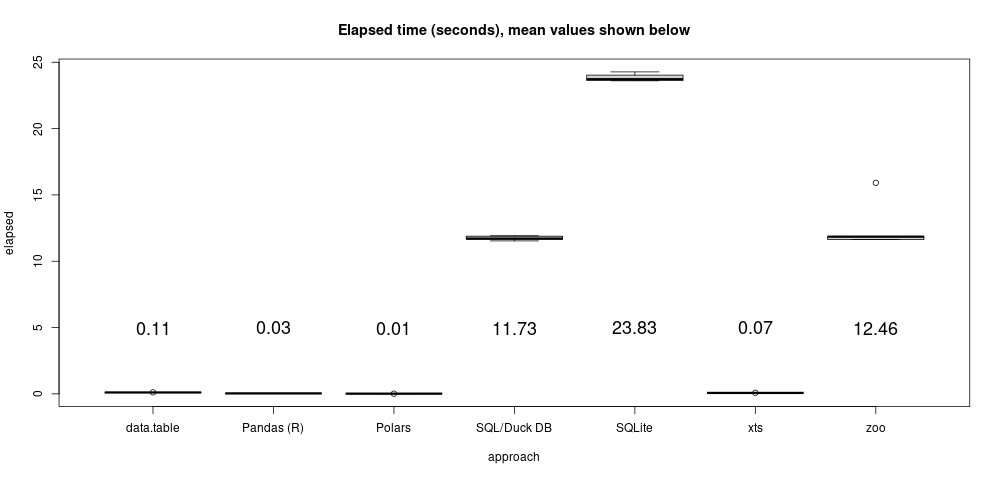

# "As of"-style joins

This piece describes a kind of table join common in time series problems
(remote sensing, IOT, finance, telemetry logging, communications, etc.).
It proceeds in two parts: first, a very simple example and some solutions
to illustrate key ideas; then a larger example to illustrate performance.

## Part 1: The basic idea

Given a table of desired dates, or times, or indeed any ordered values (call
this table "calendar"), and a table of dates and data values (call this table
"data"), the gist is to produce an output table with dates corresponding to the
"calendar" table and values corresponding to the *most recently known* value
from the "data" table. In other words, find the last known value as of each
calendar date (thus the title).

Consider the example "calendar" and "data" tables, along with the desired "as
of" join output table shown below.  Note, in particular, that not all dates in
the "calendar" table are present in the "data" table.
```{r, echo = FALSE}
suppressMessages({
library(data.table)
library(duckdb)
library(zoo)
})

set.seed(1)

start <- as.Date("2020-06-20")
calendar <- data.frame(date = seq(from = as.Date(format(start, "%Y-%m-01")), length.out = 6, by = "-1 month"))
calendar <- calendar[order(calendar[["date"]]),, drop=FALSE]

data <- data.frame(date = start - sample(240, 6, replace = TRUE), value = runif(6))
data <- rbind(data,  cbind(calendar[2,,drop = FALSE], value = 0.5))
data <- data[order(data[["date"]]),]

ans.zoo <- merge(calendar, na.locf(merge(calendar, data, all=TRUE)))
```

<div style="display: flex; font-size: 0.75em;">
<div style="flex: 8%;">
```{r, echo=FALSE}
knitr::kable(calendar, row.names = FALSE, caption = "calendar", format = "markdown")
```
</div>
<div style="margin-left: 10%; flex: 30%;">
```{r, echo=FALSE}
knitr::kable(data, row.names = FALSE, caption = "data", format = "markdown")
```
</div>
<div style="margin-left: 10%; flex: 30%;">
```{r, echo=FALSE}
knitr::kable(ans.zoo, row.names = FALSE, caption = "'as of' desired output", format = "markdown")
```
</div>
</div>


You can think about the "as of" join in different ways:

1. As a full outer join between the tables on date, followed by piece-wise constant interpolation of any missing values, followed by an inner join on date with the "calendar" table.
2. As a kind of inequality rolling join, where, for each "calendar" table date, join the value associated with the last "data" table
date less than or equal to the "calendar" table date.
3. Probably many other ways...

This note illustrates both approaches 1 and 2.

Because "as of" style joins are so common in time series settings, most time
series-specific databases usually handle this kind of thing pretty easily--for
instance, the commercial Kdb+ database handles such joins with simple, concise
syntax and extreme performance.

R and Python are also really good for time series problems and also exhibit
several ways to carry out "as of" style joins (with varying levels of
performance).

ANSI SQL is probably not the best way to express solutions to the "as of" join
problem (as we shall see), but it can be done. However, many SQL databases
include idiosyncratic approaches to more efficiently deal with this. Every SQL
approach I have seen tends to be (to me, at least) over-complicated (and slow).

If you don't feel like reading any more, the quick take away is, use R xts,
data.table, Python Pandas, or Kdb+ for this kind of problem if you need
performance.

### Some R approaches

Let's explore two possible R approaches to formulating a solution. The first
zoo-package approach conceptually follows way 1 above (piecewise constant
interpolation of missing values after an outer join). The second,
data.table-package approach hews to way 2 above (a rolling non-equi join).

First set up the simple example 'calendar' and 'data' data.frames in R:
```{r, echo = TRUE}
set.seed(1)
start <- as.Date("2020-06-20")
calendar <- data.frame(date = seq(from = as.Date(format(start, "%Y-%m-01")), length.out = 6, by = "-1 month"))
calendar <- calendar[order(calendar[["date"]]),, drop=FALSE]

data <- data.frame(date = start - sample(240, 6, replace = TRUE), value = runif(6))
data <- rbind(data,  cbind(calendar[2,,drop = FALSE], value = 0.5))
data <- data[order(data[["date"]]),]
```
These data.frames look just like the example tables shown above. Now, a zoo
approach. It uses zoo's `na.locf` function, an acronym for
"missing value, last observation carry-forward."
```{r, echo = TRUE}
library(zoo)
(ans.zoo <- merge(calendar, na.locf(merge(calendar, data, all=TRUE))))
```
R's xts package can work in the same way as the zoo approach above, but
much much faster. That will be illustrated in the performance section
below.

Data.table's "rolling join" approach produces the same result with
a nicely concise syntax:
```{r, echo = TRUE}
library(data.table)
data.dt <- data.table(data)
(ans.dt <- data.dt[calendar, on = "date", roll = TRUE])
```

The rolling data.table join is quite flexible and allows for limiting the
extent of the search for a last value, among several other options.  Also note
that both approaches also work in cases when the "data" table has more than one
column (possibly each with missing values).


### A Python Pandas approach

Pandas includes a `merge_asof` method that is very similar to data.table's
rolling joins.  It doesn't seem to work directly with R's Date type though, so
we need to convert the date columns to full date-time POSIXct first:
```{r, echo = TRUE}
calendar.posix <- data.frame(date = as.POSIXct(calendar[["date"]]))
data.posix <- data.frame(date = as.POSIXct(data[["date"]]), value = data[["value"]])

library(reticulate)
pandas <- import("pandas")
ans.py <- pandas$merge_asof(calendar.posix, data.posix, on = "date")
ans.py[["date"]] <- as.Date(ans.py[["date"]])
ans.py
```

### SQL

It took me a while to come up with a generic SQL approach (try it yourself!).
Internet searches for phrases like "SQL as.of-style join," "SQL last value fill
in join," and so on return many results of variable quality, most (all?)
involving idiosyncratic syntax specific to a particular (often commercial)
database (for example Microsoft SQL Server, or Oracle databases, etc.).

Giving up on the internet, I was at least able to cook up the following working
vanilla SQL example. Be warned--it's icky--perhaps offensive, even--and I don't expect
it to exhibit even reasonable performance but it does work!
```{r, echo = TRUE}
library(duckdb)
con <- dbConnect(duckdb())
duckdb_register(con, "data", data)
duckdb_register(con, "calendar", calendar)

Q <- "WITH z AS (
  SELECT date, (NULL) AS value FROM calendar
  UNION
  SELECT date, value FROM data
  ORDER BY date
),
a AS (
  SELECT date, value, ROW_NUMBER() OVER (
    ORDER BY date
    RANGE BETWEEN UNBOUNDED PRECEDING AND CURRENT ROW
  ) * (CASE WHEN value IS NULL THEN 0 ELSE 1 END) AS i
  FROM z
),
b AS (
  SELECT date,  MAX(i) OVER (
    ORDER BY date
    RANGE BETWEEN UNBOUNDED PRECEDING AND CURRENT ROW
  ) AS j
  FROM a
),
c AS (
  SELECT b.date, value FROM a, b
  WHERE a.i > 0 AND a.i = b.j
),
d AS (
  SELECT calendar.date, value FROM calendar, c
  WHERE calendar.date = c.date
  ORDER BY c.date
)
SELECT * FROM d UNION SELECT * FROM d
"
(ans.duck <- dbGetQuery(con, Q))
```
The generic SQL approach is so unspeakably horrible that, until DuckDB
implements a special function just for this scenario, don't try this at home.
I guess that's part of the point of all of these examples, sometimes SQL
is just not the right tool for the job.

Of course, I am far from an expert--if you can find a better way to formulate a
solution to this problem in **plain vanilla** SQL let me know (send a pull request or
whatever)!


## Brief interlude (skip ahead if bored)

The examples here show a join between a (usually smaller, regular)
single-column "calendar" table of desired dates/times/otherwise ordered things
and another (usually much larger, irregular) *two*-column "data" table of
dates/times/ordered things and corresponding values.

It's easy to imagine extending that scenario to cover more than two columns in
the "data" table--to a table with an arbitrary number of columns and an
arbitrary number of missing values within. In other words, a kind of "sparse"
table.  Indeed, all of the R and Python approaches to the "as of" join handle
this case. My hand-rolled SQL approach does not, but could be extended to (with
some annoying syntactical difficulty).

But, sparse data.frames still encode (store) missing values in all of these
approaches. That means that, if the data are huge and the calendar table is,
relatively speaking, small, then it could be much more memory efficient to
compute the joins column-by-column, and then join all those small results
together.

That approach for handling many "data" columns nicely fits into a map/reduce
paradigm (which means it can easily be run in parallel so long as the
"calendar" table is small enough to distribute).  It's advantage is
scalability. A disadvantage is complexity.

Changing the data model presents another way however: store the huge "data"
table full of missing values as a sparse matrix. Then the huge matrix can
be efficiently stored and operated on as a whole.

Such a data model and approach is available in several systems, including at
least Microsoft SQL server, SciDB, TileDB (and *many* others).
(Imagine if zoo's 'na.locf' function worked on the R Matrix-package sparse
matrices). The advantage of this approach is conceptual and practical
simplicity. A possible disadvantage is lack of easy scalability, depending on
the implementation.


## Part 2: Performance

Keeping things simple, performance is explored below by running a bigger
version of the example from Part 1 above. Except, it's not really all *that*
big, 5 million "data" table observations and about 250 thousand (every minute)
calendar table desired date/times. This example uses POSIXct date/time values
instead of simple R Date (date only) values used in the example above. It
easily fits into the main memory of my 8GB laptop, but is sufficiently large to
start to see performance differences between approaches. Here is the data
setup:

```{r, eval = FALSE}
set.seed(1)
end <- as.POSIXct("2020-06-20")
start <- as.POSIXct("2020-1-1")
dt <- as.integer(difftime(end, start, units = "secs"))
# Every minute
calendar <- data.frame(date = seq(from = start, to = end, by = "+1 min"))

N <- 5e6
data <- data.frame(date = end - runif(N) * dt, value = runif(N))
data <- data[order(data[["date"]]),]
```

Each approach proceeds as in Part 1, with two new approaches, summarized along
with brief comments below. But first, the performance timing results:

</img>

Xts and data.table are, as expected, super-fast, with xts prevailing here. This
example is too small to really put those efficient R packages through their
paces.  Despite a conceptually identical approach to xts, the zoo way is quite
a bit slower.

And despite similarity to data.table's approach, Pandas is slower than expected
here when run through R's reticulate package directly on R data.frame
objects--indicated here by the "Pandas(R)" label.

Now, I know better that Pandas should be exceptionally well-tuned for this kind
of problem, so the exhibited slowness must be due to reticulate. My guess is
repeated data copy/conversions on between R and Python in each iteration.

To give Pandas a fair shake, another approach saves the data as CSV files and
runs an independent Python program natively on Pandas data frames, indicated by
the "Python(Native)" label. As expected, Pandas' excellent performance here is
indistinguishable from xts.

I'm not surprised that the SQL solutions ran slowly, if for no other reason
than the offensive query I wrote. I was surprised that, given the awful query,
SQLite handily out-performed DuckDB. However, I did not include the data
transfer time between R and SQLite in the comparison (which adds only a small
overhead for this relatively small problem).


Basic details for each approach are summarized below.

### Zoo

```{r, eval = FALSE}
library(zoo)
t.zoo <- replicate(6, system.time({
 ans.zoo <<- merge(calendar, na.locf(merge(calendar, data, all = TRUE)), all.x = TRUE)
}))
```

### Xts

R's xts package defines a high-performance ordered index class that
substantially extends the analogs in the zoo package. It has many convenient
functions and can solve this problem in more than one way. In particular,
it can follow the same zoo approach used above (but runs *much* faster):

```{r, eval = FALSE}
library(xts)
calendar.xts <- xts(, order.by = calendar[["date"]])
data.xts <- xts(data[["value"]], order.by = data[["date"]])
t.xts <- replicate(10, system.time({
  ans.xts <<- merge(calendar.xts, na.locf(merge(calendar.xts, data.xts)), join = "left")
}))
```

### Data.table

The data.table approach is exactly as in Part 1 above:
```{r, eval = FALSE}
library(data.table)
setDTthreads(8)
data.dt <- data.table(data)
t.dt <- replicate(10, system.time({
  ans.dt <<- data.dt[calendar, on = "date", roll = TRUE]
}))
```

### Python Pandas using R data.frames via reticulate

Because this example already uses POSIXct date/times, we don't need to convert
as in the simple example in Part 1. Otherwise identical.

```{r, eval = FALSE}
library(reticulate)
pandas <- import("pandas")
t.py <- replicate(10, system.time({
  ans.py <<- pandas$merge_asof(calendar, data, on = "date")
}))
```

### Native Python Pandas

```{r, eval = FALSE}
library(reticulate)
program <- '
import pandas as p
import numpy as np
import time

calendar = p.read_csv("calendar.csv")
calendar["date"] = p.to_datetime(calendar["date"])
data = p.read_csv("data.csv")
data["date"] = p.to_datetime(data["date"])

def run(i):
  tic = time.perf_counter()
  ans = p.merge_asof(calendar, data, on = "date")
  return time.perf_counter() - tic

ans = list(map(run, np.arange(1, 11)))
'
t.nativepy <- py_to_r(py_run_string(program))[["ans"]]
```

### DuckDB

DuckDB proceeds exactly as in Part 1, using the same SQL query Q (so not
repeated here). The only quirk is that the (otherwise correct) result comes
back from DuckDB with a different POSIXct timezone than the calendar
data.frame.

It's worth repeating again that a really cool feature of DuckDB is that it can
work directly on R data.frames without copying data.

```{r, eval =FALSE}
library(duckdb)
Sys.setenv(DUCKDB_NO_THREADS = 8)
con <- dbConnect(duckdb())
duckdb_register(con, "data", data)
duckdb_register(con, "calendar", calendar)
t.duck <- replicate(6, system.time({
  ans.duck <<- dbGetQuery(con, Q)
}))
```

### SQLite

We added another embedded SQL database for comparison, SQLite. Unlike DuckDB,
we need to copy the "calendar" and "data" data.frames over to SQLite first.
Otherwise, we ran the same query as above:

```{r, eval =FALSE}
library(RSQLite)
lite <- dbConnect(RSQLite::SQLite(), ":memory:")
dbWriteTable(lite, "calendar", calendar)
dbWriteTable(lite, "data", data)
t.lite <- replicate(6, system.time({
  ans.duck <<- dbGetQuery(lite, Q)
}))
```
Oddly, the SQLite "date" column is returned to R as a numeric value--in fact
unclassed POSIXct values. But otherwise the result is correct.


## Misc. references

- [DuckDB](https://duckdb.org/)
- [R xts](http://joshuaulrich.github.io/xts/)
- [R data.table](https://github.com/Rdatatable/data.table)
- [R zoo](https://zoo.r-forge.r-project.org/)
- [Pandas](https://pandas.pydata.org/)

Alternative data models...

- [Microsoft SQLServer sparse columns](https://docs.microsoft.com/en-us/sql/relational-databases/tables/use-sparse-columns?view=sql-server-ver15)
- [SciDB](https://www.paradigm4.com)
- [TileDB](https://tiledb.com/)

