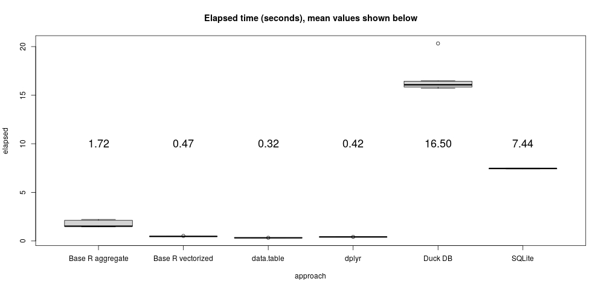

# Last item per group

Like the [TPC-H
example](https://bwlewis.github.io/duckdb_and_r/tpch/tpch.html), this problem
uses made-up data to illustrate a simple task that I encountered in some data
analysis work using, of all things, Salesforce data.  The task applied to table
or R data frame is a simple one:

* Group data by one column.
* For each group, select the last row within the group as ordered by an ordering column.

The result is a new data frame or table that subsets the original rows. In
practice there might be millions of rows and thousands of groups (or more).
It's a simple task. A representative example we use below simply returns the
most recent row by group.


## Data setup

The following R code prepares a very simple example.  It uses the companion
[fake.r](https://XXX) R data script to help generate a data frame of three
columns: date, company and value. The examples below simply return the most
recent entries by company (group by "company", within group order by "date").

```{r}
source("fake.r")
set.seed(1)
N_GROUPS <- 100
MAX_LEN <- 1e5
make_believe <- list(lengths = sample(MAX_LEN, N_GROUPS, replace = TRUE),
                     values = paste(sample(names, N_GROUPS, replace = TRUE),
                                    sample(sectors, N_GROUPS, replace = TRUE)))
make_believe <- inverse.rle(structure(make_believe, class = "rle"))
N <- length(make_believe)
example <- data.frame(date = Sys.Date() - sample(365, N, replace = TRUE),
                      company =  sample(make_believe), value = runif(N), stringsAsFactors = TRUE)
example$date <- as.POSIXct(example$date) + runif(N)
```
Note that I've added a random fractional part to the dates to get a unique
last date for each group. This uses a special R feature where the POSIXct
date class can have sub-second accuracy. As we shall see below, this can
get us into trouble sometimes...

The example data frame consists of `r format(NROW(example), big.mark = ",")` rows and looks like:

```{r}
head(example, n = 10)
```

## A base R approach using aggregate

This approach is really simple, but not particularly fast.
```{r, eval = FALSE}
t1 <- replicate(10, system.time({
  i <- order(example$company, example$date, method = "radix")
  base <<- aggregate(example$value[i], by = list(company = example$company[i]), FUN = function(x) tail(x, 1))
}))
```

## A base R vectorized way

A natural R approach using indexing vectors. It's pretty fast.
```{r, eval = FALSE}
t2 <- replicate(10, system.time({
  i <- order(example$company, example$date, method = "radix") # order by company, date
  start <- c(1, diff(as.integer(example$company[i]))) != 0    # start of each company block
  end   <- c(start[-1], TRUE)                                 # end of each company block
  vec  <<- data.frame(company = example$company[i[end]],
                      value   = example$value[i[end]])
}))
```

## A data.table approach

As usual, data.table is incredibly fast. And characteristically terse.
```{r, eval = FALSE}
t3 <- replicate(10, system.time({
  example_dt <- data.table(example, key = c("company", "date"))
  dtb <<- example_dt[, tail(.SD, 1), by = c("company"), .SDcols = "value"]
}))
```

## Dplyr

The dplyr way is also extremely fast, and uses really clear syntax. It's
an elegant approach to solving this problem.

```{r, eval = FALSE}
t4 <- replicate(10, system.time({
  dpl <<- example %>% group_by(company) %>% summarize(value = last(value, order_by = date))
}))
```

## SQL/DuckDB try 1

This may simply be an illustration of my ignorance, but I struggled to find a
simple SQL solution to this apparently easy task. Eventually I cooked up
something using a SQL WINDOW-ed operation, which admittedly is pretty awkward
to read. Perhaps the following can be improved?

The DuckDB example notably uses DuckDB directly on an R data frame, a really
cool feature...

```{r, eval = FALSE}
library(duckdb)
con <- dbConnect(duckdb())
duckdb_register(con, "example", example)

duck <- dbGetQuery(con, "SELECT company, value FROM
(SELECT company, date, value, ROW_NUMBER() OVER
  (PARTITION BY company ORDER BY date DESC) AS row FROM example)
AS yikes WHERE row = 1")
```
Hmmm. That seemed to run slowly, and unfortunately the results don't agree with
any of the previous R approaches?! See, for instance:
```{r, eval = FALSE}
all(apply(merge(vec, duck, by = "company")[, 2:3], 1, diff) == 0)
# [1] FALSE
```

Maybe the query is wrong? Let's see...

## SQL/RSQLite  try 2

Let's try that last SQL query on the SQLite database to see if it works.
```{r, eval = FALSE}
library(RSQLite)
lite <- dbConnect(RSQLite::SQLite(), ":memory:")
dbWriteTable(lite, "example", example)
t6 <- replicate(10, system.time({
  dlite <<- dbGetQuery(lite, "SELECT company, value FROM
(SELECT company, date, value, ROW_NUMBER() OVER
  (PARTITION BY company ORDER BY date DESC) AS row FROM example)
AS yikes WHERE row = 1")
}))

all(apply(merge(vec, duck, by = "company")[, 2:3], 1, diff) == 0)
# [1] TRUE
```
Success! After puzzling over this, I realized that the culprit
is my use of R's extended POSIX time time with less than second
precision. Although RSQLite seems to understand it fine, DuckDB
does not.

## SQL/DuckDB try 3

So, let's try this again, explicitly converting R's POSIX type
into something DuckDB is sure to understand, double-precision
numbers:

```{r, eval=FALSE}
duckdb_unregister(con, "example")
example$date_numeric <- as.numeric(example$date)
duckdb_register(con, "example", example)
t5 <- replicate(10, system.time({
  duck <<- dbGetQuery(con, "SELECT company, value FROM (SELECT company, date, value, ROW_NUMBER() OVER (PARTITION BY company ORDER BY date DESC) AS row FROM example) AS yikes WHERE row = 1")
}))

all(apply(merge(vec, duck, by = "company")[, 2:3], 1, diff) == 0)
# [1] TRUE
```
Aha success! But still very slow. I'm not sure, but I wonder if DuckDB's silent
mis-understanding of an R type is a bug? I'll report that to the authors.


## Performance and comments

Personally, I find the dyplr approach to this task particularly elegant with
plain old vectorized base R my second prefernce. But, that's just, like, my
opinion.

```{r, eval = FALSE}
timings <- rbind(data.frame(approach = "Base R aggregate", elapsed = t1[3, ]),
                 data.frame(approach = "Base R vectorized", elapsed = t2[3, ]),
                 data.frame(approach = "data.table", elapsed = t3[3, ]),
                 data.frame(approach = "dplyr", elapsed = t4[3, ]),
                 data.frame(approach = "Duck DB", elapsed = t5[3, ]),
                 data.frame(approach = "SQLite", elapsed = t6[3, ]))
jpeg(file="last_upshot.jpg", quality=100, width=1000)
boxplot(elapsed ~ approach, data = timings, main = "Elapsed time (seconds), mean values shown below")
m = aggregate(list(mean=timings$elapsed), by=list(timings$approach), FUN=mean)
text(seq(NROW(m)), y = 10, labels = sprintf("%.2f", m$mean), cex = 1.5)
dev.off()
```
</img>

Neither DuckDB nor SQLite distinguish themselves performance-wise in this
seemingly simple task. So much for query optimization I guess.  All of the R
approaches work very well; choosing among them boils down to syntax preference.

### The SQL query eludes dplyr

My first, lazy, attempt at a SQL solution to this problem was to simply have
dplyr write the query for me! This is often a neat way to write complex
SQL queries. Here is an example of a basic grouped aggregation:
```{r, eval = FALSE}
tbl(con, "example") %>% group_by(company) %>% summarize(avg = mean(value, na.rm = T)) %>% show_query()
```
```
<SQL>
SELECT "company", AVG("value") AS "avg"
FROM "example"
GROUP BY "company"
```
Pretty cool!

Except, not in this case. I get this error:
```{r, eval = FALSE}
tbl(con, "example") %>% group_by(company) %>% summarize(value = last(value, order_by = date)) %>% show_query()
```
```
Error: `last()` is only available in a windowed (`mutate()`) context
```
I guess there exist few corner cases like this where dplyr can't yet generate
appropriate back-end queries.

