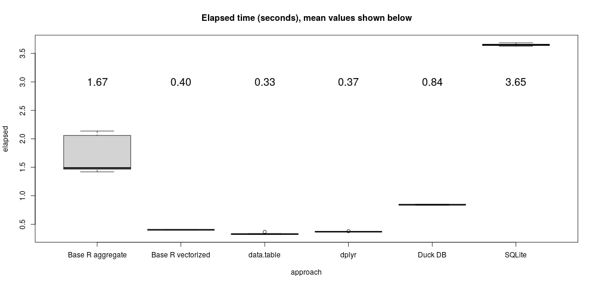

# Last item per group

Like the [TPC-H
example](https://bwlewis.github.io/duckdb_and_r/tpch/tpch.html), this problem
uses made-up data to illustrate a simple task that I encountered in some data
analysis work using, of all things, Salesforce data.  The task applied to table
or R data frame is a simple one:

* Group data by one column.
* For each group, select exactly one last row within the group as ordered by an ordering column (choosing arbitrarily among tied ordered values).

The result is a new data frame or table that subsets the original rows. In
practice there might be millions of rows and thousands of groups (or more).
It's a simple task. A representative example we use below simply returns the
most recent row by group.

I am indebted to Richard Wesley at DuckDB Labs for teaching me a superior
SQL approach to solving this problem than my original one. See 
https://bwlewis.github.io/duckdb_and_r/last/declarative.html for a discussion
of that.

## Data setup

The following R code prepares a very simple example.  It uses the companion
[fake.r](https://raw.githubusercontent.com/bwlewis/duckdb_and_r/main/last/fake.r)
R data script to help generate a data frame of three
columns: date, company and value. The examples below simply return the most
recent entries by company (group by "company", within group order by "date").

```{r}
source("fake.r")
set.seed(1)
N_GROUPS <- 100
MAX_LEN <- 1e5

make_believe <- list(lengths = sample(MAX_LEN, N_GROUPS, replace = TRUE),
                     values = paste(sample(names, N_GROUPS, replace = TRUE),
                                    sample(sectors, N_GROUPS, replace = TRUE)))
make_believe <- inverse.rle(structure(make_believe, class = "rle"))
N <- length(make_believe)

example <- data.frame(date = Sys.Date() - sample(365, N, replace = TRUE),
                      company =  sample(make_believe), value = round(runif(N), 1), stringsAsFactors = TRUE)
example[["date"]] <- as.POSIXct(example[["date"]]) + example[["value"]]
```
The example dates have added a small fractional part (example values) to
make them semi-unique.  This uses a special R feature where the POSIXct
date class can have sub-second accuracy. As we shall see below, this can
get us into trouble sometimes...

The example data frame consists of `r format(NROW(example), big.mark = ",")` rows and looks like:

```{r}
head(example, n = 10)
```

## A base R approach using aggregate

This approach is really simple, but not particularly fast.
```{r, eval = FALSE}
t1 <- replicate(10, system.time({
  i <- order(example[["company"]], example[["date"]], method = "radix")
  base <<- aggregate(example[["value"]][i], by = list(company = example[["company"]][i]), FUN = function(x) tail(x, 1))
}))
```

## A base R vectorized way

The natural base R approach using indexing vectors is pretty fast.
```{r, eval = FALSE}
t2 <- replicate(10, system.time({
  i <- order(example[["company"]], example[["date"]], method = "radix", decreasing = TRUE) # reverse order by company, date
  last <- c(1, diff(as.integer(example[["company"]][i]))) != 0              # start of each company block (last value)
  vec  <<- data.frame(company = example[["company"]][i[last]],
                      value   = example[["value"]][i[last]])
}))
```

## A data.table approach

As usual, data.table is incredibly fast. And characteristically terse.
```{r, eval = FALSE}
t3 <- replicate(10, system.time({
  example_dt <- data.table(example, key = c("company", "date"))
  dtb <<- example_dt[, tail(.SD, 1), by = c("company"), .SDcols = "value"]
}))
```

## Dplyr

The dplyr way is also extremely fast and uses really clear syntax. It's
an elegant approach to solving this problem.

```{r, eval = FALSE}
t4 <- replicate(10, system.time({
  dpl <<- example %>% group_by(company) %>% summarize(value = last(value, order_by = date))
}))
```

## SQL/RSQLite

The most efficient SQL solution to this problem first finds the max(date) by company
and then joins that result back with the original table to obtain corresponding values.
Then, duplicates are removed as needed to obtain a single value per company.
For a discussion of this somewhat verbose syntax, see
https://bwlewis.github.io/duckdb_and_r/last/declarative.html

Fist let's try a query with the  SQLite database engine to see if it works.
```{r, eval = FALSE}
library(RSQLite)
lite <- dbConnect(RSQLite::SQLite(), ":memory:")
dbWriteTable(lite, "example", example)
t6 <- replicate(10, system.time({
  dlite <<- dbGetQuery(lite, "WITH ans AS (SELECT e.company, value FROM example AS e,
    (SELECT company, MAX(date) AS date FROM example GROUP BY company) AS m
     WHERE e.company = m.company AND e.date = m.date)
  SELECT company, MAX(value) FROM ans GROUP by company")
}))
```
After puzzling over discrepancies I saw when trying this with DuckDB, I
realized that the culprit is my use of R's extended POSIX time time with less
than second precision. Although RSQLite seems to understand it fine, DuckDB
does not.

## SQL/DuckDB

So, let's try this with DuckDB  but explicitly converting R's POSIX type into
something DuckDB is sure to understand, double-precision numbers:

```{r, eval=FALSE}
duckdb_unregister(con, "example")
example[["date_numeric"]] <- as.numeric(example[["date"]])
duckdb_register(con, "example", example)
t5 <- replicate(10, system.time({
  duck <<- dbGetQuery(con, "WITH ans AS (SELECT e.company, value FROM example AS e,
    (SELECT company, MAX(date_numeric) AS date FROM example GROUP BY company) AS m
     WHERE e.company = m.company AND e.date_numeric = m.date)
  SELECT company, MAX(value) FROM ans GROUP by company")
}))
```
I think DuckDB's silent mis-understanding of an R type is a bug? It would
probably be better to stop with an error or at least display a warning.  I'll
report that to the authors.


## Performance and comments

Personally, I find the dyplr approach to this task particularly elegant with
plain old vectorized base R my second choice.

```{r, eval = FALSE}
timings <- rbind(data.frame(approach = "Base R aggregate", elapsed = t1[3, ]),
                 data.frame(approach = "Base R vectorized", elapsed = t2[3, ]),
                 data.frame(approach = "data.table", elapsed = t3[3, ]),
                 data.frame(approach = "dplyr", elapsed = t4[3, ]),
                 data.frame(approach = "Duck DB", elapsed = t5[3, ]),
                 data.frame(approach = "SQLite", elapsed = t6[3, ]))
jpeg(file="last_upshot.jpg", quality=100, width=1000)
boxplot(elapsed ~ approach, data = timings, main = "Elapsed time (seconds), mean values shown below")
m = aggregate(list(mean = timings[["elapsed"]]), by=list(timings[["approach"]]), FUN=mean)
text(seq(NROW(m)), y = 10, labels = sprintf("%.2f", m[["mean"]]), cex = 1.5)
dev.off()
```
</img>

Neither DuckDB nor SQLite distinguish themselves performance-wise in this
seemingly simple task. So much for query optimization I guess.  All of the R
approaches work very well; choosing among them boils down to syntax preference.

<h3 style="text-decoration: line-through;">
The SQL query eludes dplyr</h3>

My first, lazy, attempt at a SQL solution to this problem was to simply have
dplyr write the query for me! This is often a neat way to write complex
SQL queries. Here is an example of a basic grouped aggregation:
```{r, eval = FALSE}
tbl(con, "example") %>% group_by(company) %>% summarize(avg = mean(value, na.rm = T)) %>% show_query()
```
```
SELECT "company", AVG("value") AS "avg"
FROM "example"
GROUP BY "company"
```
Pretty cool!

Except, not in this case. I get this error:
```{r, eval = FALSE}
tbl(con, "example") %>% group_by(company) %>% summarize(value = last(value, order_by = date)) %>% show_query()
```
```
Error: `last()` is only available in a windowed (`mutate()`) context
```
UPDATE: Hadley Wickham explains that `last` is subject to some query translation issues, but an
equivalent alternative dplyr formulation works fine:
```{r, eval = FALSE}
example %>%
  group_by(company) %>%
  arrange(desc(date), .by_group = TRUE) %>%
  filter(row_number() == 1L) %>%
  select(company, value)
```
```
SELECT `company`, `value`
FROM (SELECT `date`, `company`, `value`
FROM (SELECT `date`, `company`, `value`,
  ROW_NUMBER() OVER (
    PARTITION BY `company` ORDER BY `date` DESC
  ) AS `q01`
FROM `df`) `q01`
WHERE (`q01` = 1)) `q02`
```


### Appendix: What's with that 'AS yikes' in the query?

DuckDB (but not SQLite) required that I label (alias) the sub-query for reasons
unknown to me. I'm not sure what the SQL ISO/IEC 9075-2:2016 standard requires,
and I don't really want to pay $250 to find out.  For me, it's just another
example of wide variation in SQL implementations across database systems.


### Postscript

I learned about the SQL `LAST_VALUE` function and formulated this alternative
SQL query in search of greater performance:

```
SELECT company, MAX(last_value) FROM
  (SELECT company,
  LAST_VALUE (value) OVER (
    PARTITION BY company
    ORDER BY date_numeric
        RANGE BETWEEN UNBOUNDED PRECEDING AND 
        UNBOUNDED FOLLOWING
  ) last_value
FROM example) AS superfluous_required_alias
GROUP BY company;
```

While still hard to read in my opinion, this query at least removes the
somewhat weird row numbering scheme. But, alas, performance is about unchanged
from the previous example query, on my system averaging about 16.5 seconds over
10 runs.
