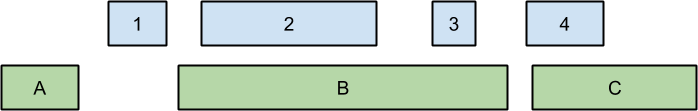
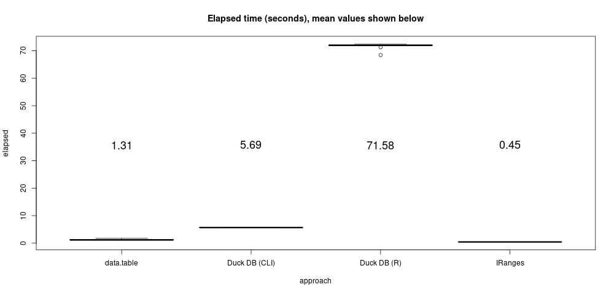

# Overlap (range) joins on genomic data, revisited May 2022

This is an update of an example I first wrote in the fall of 2021 here:
https://bwlewis.github.io/duckdb_and_r/ranges/ranges.html

I was inspired to look into this example again by Richard Wesley's recent blog
post on range/inequality joins here:
https://duckdb.org/2022/05/27/iejoin.html.  Things have changed since my
original example. In particular, DuckDB overall has  gotten faster at this kind
of problem. However the <b>R package version</b> of
DuckDB seems to have gotten (substantially) slower somehow?

In light of a different R package performance issue (see
https://gist.github.com/hannes/e2599ae338d275c241c567934a13d422#gistcomment-4090559
and comments therein), it appears that, at this moment, there are two DuckDBs:
the R-packaged DuckDB and mainline DuckDB for Python and everyone else.

At the time of this writing, I installed a new version of DuckDB from GitHub
(CLI version v0.3.5-dev651 a25b6e307) in order to make sure to get the latest
features. Included in that GitHub installation is the R package version 0.3.3
(behind the CLI).  The version of R used in the updated example was R version
4.1.3 (2022-03-10).  The computer used is the same as in previous tests: my
cheap Acer laptop with 8 GB LPDDR4 RAM and 8 AMD Ryzen 7 4700U CPU cores.  The
R data.table package version used below was 1.14.2 and the IRanges package
version was 2.26.0 (both also updated from the older version of this note).

The Bioconductor way of installing packages has also changed (see the IRanges
example below) and we found that the current R `download.file` function is not
as robust as it used to be so we added the `method="wget"` parameter to more
reliably download the raw data files.


# The example


Finding overlapping regions between two sets of coordinate values is a common
problem in computational genomics and other disciplines.  At least two R
packages can very rapidly perform this computation: the IRanges package by
Pages, Aboyoun and Lawrence in the bioconductor[^1] and the widely popular
data.table package by Dowle, Short, Lianoglou, Srinivasan, and others[^2].

[^1]: Gentleman R.C., Carey V.J., Bates D.M., Bolstad B., Dettling M., Dudoit S., Ellis B., Gautier L., Ge Y., Gentry J., Hornik K., Hothorn T., Huber W., Iacus S., Irizarry R., Leisch F., Li C., Maechler M., Rossini A.J., Sawitzki  ., Smith C., Smyth G., Tierney L., Yang J.Y. and Zhang J. (2004) Bioconductor: open software development for computational biology and bioinformatics. Genome Biol. 5(10): R80.

[^2]: https://github.com/Rdatatable/data.table/wiki


## The Overlap Join

The _overlap join_ finds overlapping regions between two tables of coordinates.
The following figure, adapted from Alex Poliakov at Paradigm4, illustrates a
simple example. The right to left extent of the blue and green boxes depicts
two sets of ranges, respectively.



The overlap join operation finds ranges with overlapping extents, for example
the green box labeled "B" overlaps with the blue boxes "2" and "3", and the
green box labeled "C" overlaps with the blue box labeled "4." In practice,
overlap joins may be performed on tables with millions of ranges.


The example presented below finds overlaps
between genomic variant coordinates from the 1000 genomes
project[^4], and a list of human gene coordinates from
https://www.pharmgkb.org/ [^5]. The example proceeds as follows:

[^4]: An integrated map of genetic variation from 1,092 human genomes, McVean et Al, Nature 491, 56-65 (01 November 2012) doi:10.1038/nature11632.

[^5]: M. Whirl-Carrillo, E.M. McDonagh, J. M. Hebert, L. Gong, K. Sangkuhl, C.F. Thorn, R.B. Altman and T.E. Klein. "Pharmacogenomics Knowledge for Personalized Medicine" Clinical Pharmacology & Therapeutics (2012) 92(4): 414-417.

1. Find variant and gene overlaps
2. Count the number of variants that overlap each gene by gene symbol
3. Order the genes by number of variant overlaps

By genomic standards, this is a small problem. The raw data files consume about
1.9 GB compressed, but the actual range data are pretty small: about 9 million
variant coordinates and only about 2,100 gene ranges. As you can imagine, a lot
of the work in this problem involves parsing the raw data to uncover those
ranges.


## Download the data files

I've saved the genomic variant and genes data as an R data file that you
can directly download from:

https://raw.githubusercontent.com/bwlewis/duckdb_and_r/main/ranges/variants_genes.rdata

which you can download into an R session with
```{r, eval=FALSE}
library(data.table)
load(url("https://raw.githubusercontent.com/bwlewis/duckdb_and_r/main/ranges/variants_genes.rdata"))
```
Unless you are interested in how the original data files are processed,
feel free to download that and skip ahead to the examples
<a href="#the_examples">here</a>.


```{r, eval=FALSE}
download.file("ftp://ftp-trace.ncbi.nih.gov/1000genomes/ftp/release/20130502/ALL.chr7.phase3_shapeit2_mvncall_integrated_v5a.20130502.genotypes.vcf.gz", destfile = "ALL.chr7.phase3_shapeit2_mvncall_integrated_v5a.20130502.genotypes.vcf.gz", method="wget")
download.file("ftp://ftp-trace.ncbi.nih.gov/1000genomes/ftp/release/20130502/ALL.chr8.phase3_shapeit2_mvncall_integrated_v5a.20130502.genotypes.vcf.gz", destfile = "ALL.chr8.phase3_shapeit2_mvncall_integrated_v5a.20130502.genotypes.vcf.gz", method="wget")
download.file("https://raw.githubusercontent.com/bwlewis/1000_genomes_examples/master/genes.tsv", destfile = "genes.tsv")
```

## Data setup, or, pipelined parallelism is the best parallelism!

The following code parses the input variant files into R data frames with
position, reference allele, and alternate allele columns. It results in a list
called `variants` with two data frames of variant coordinates and values, one
for chromosome 7 and one for chromosome 8.

```{r, eval=FALSE}
library(parallel)
library(data.table)

f <- function(file)
{
  cmd <- sprintf("zcat %s | sed '/^#/d;/IMPRECISE/d' |  cut -f 2,4,5", file)
  name <- gsub(".phase.*","", file)
  print(name)
  x <- read.table(pipe(cmd), stringsAsFactors = FALSE)
  names(x) <- c("start", "ref", "alt")

  # Process extra comma-separated alleles
  idx <- grepl(",", x[["alt"]])
  s <- strsplit(x[idx, "alt"], ",")
  # replace these rows with 1st alternate allele
  x[idx, "alt"] <- vapply(s, function(z) z[1], "")
  # Add new rows corresponding to other listed alternates
  ref <- x[idx, 1:2]
  N   <- vapply(s, length, 1) # numbers of alternates by row
  alt <- Map(function(i)
    { 
      j <- which(N == i)
      cbind(ref[j, ], alt = vapply(s[j], function(z) z[i], ""))
    }, seq(2, max(N)))
  rbindlist(c(list(x), alt))
}
files <- dir(pattern = "*.vcf.gz")
variants <- mcMap(f, files)
# name data frames by chromosome number:
names(variants) <- gsub("^ALL.chr", "", gsub(".phase.*", "", names(variants)))
```

This step takes about 160 seconds on my laptop (to parse 9,362,139 variants on
both chromosomes 7 and 8).

The parsing program is complicated by the doubly-delimited data file format. In
particular more than one alternate allele may be listed per line separated by
commas (the remainder of the file is tab separated). R handles the extra format
complexity with relative ease and efficiency. Parsing multiple alternate
alleles adds only a dozen lines to the R program and runs very fast. Languages
like R, Python, Perl, awk, etc. excel at handling complex data formats like
this.

I use shell utilities here to help uncompress and process the TSV files.  R's
`pipe` connection object makes it easy to operate on pipelines of shell
commands conveniently from R.  (The data.table package includes similar
functionality but, somewhat unfortunately, using a different syntax).

Because the above processing pipeline includes several stages (zcat, sed, cut,
read.table), there is a fair amount of parallel computation going on.
The script additionally uses the explicitly parallel `mcMap` function which
may lead to some over-committing of CPU resources, but still generally improves
performance.

Note that the script omits imprecisely specified variants, further described
here: http://goo.gl/PFsIsP. Handling imprecise variants would add a lot of
complexity to this simple example.

The genes.tsv file is small and fast to parse by comparison.  The following
script loads the listed gene ranges corresponding to chromosomes 7 and 8 into a
data frame. Note that some listed genes contain incomplete information (NA) and
are removed and that we're using the GRCh37 reference genome positions.

```{r, eval=FALSE}
cmd <- "cat genes.tsv | cut -f 6,13,14,15 | grep 'chr[7,8]' | sed -e 's/chr7/7/;s/chr8/8/'"
p <- pipe( cmd, open="r")
genes <- na.omit(read.table(p, stringsAsFactors = FALSE, header = FALSE, sep = "\t"))
close(p)
names(genes) <- c("gene", "chromosome", "start", "end")
genes <- genes[genes[["start"]] > 0 & genes[["end"]] > 0, ]
```


<hr/>
<h1 id="the_examples">Implementation examples</h1>


## R data.table

The popular R data.table package includes a fast overlap join function called
`foverlaps`.  The following code uses that function to compute the overlap join
between variants and genes for each chromosome, and then ranks genes by the by
the count of overlapping variants per gene.  The code runs in parallel over
each chromosome using the `mcMap` function.

```{r, eval=FALSE}
overlap <- function(chromosome)
{
  x <- variants[[as.character(chromosome)]]
  x[["end"]] <- x[["start"]] + nchar(x[["ref"]])

  g <- genes[genes[["chromosome"]] == chromosome, c(1, 3, 4)]
  setDT(g, key = c("start", "end"))
  setDT(x)
  foverlaps(x, g, nomatch = 0)[, .N, by = gene]
}
t1 <- replicate(10, system.time(ans.DT <<- rbindlist(mcMap(overlap, c(7, 8)))))
ans.DT <- ans.DT[order(ans.DT[["N"]], decreasing = TRUE), ]
```
Example output of this step looks like:
```{r,eval=FALSE}
head(ans.DT, n = 10)
#  CSMD1 CNTNAP2    SGCZ    SDK1   MAGI2  PTPRN2  DLGAP2   CSMD3    NRG1   AUTS2 
# 147459   76073   52174   45067   43984   41662   40362   34397   33001   31275 
```

## R IRanges

We can similarly compute counts of overlapping variants and genes using the
IRanges package from the bioconductor.

If you don't already have it, you can install the IRanges package with:
```{r, eval=FALSE}
install.packages("BiocManager")
BiocManager::install("IRanges")
```

This example is almost identical to the data.table version above:
```{r, eval=FALSE}
library(IRanges)
overlap = function(chromosome)
{
  x <- variants[[as.character(chromosome)]]
  ir1 <- IRanges(start=x[["start"]], end=x[["start"]] + nchar(x[["ref"]]))
  g <- genes[genes[["chromosome"]] == chromosome, c(1, 3, 4)]
  ir2 <- IRanges(start = g[["start"]], end = g[["end"]])
  ans <- findOverlaps(ir1, ir2)
  data.frame(gene = g[["gene"]], count = countRnodeHits(ans))
}
t2 <- replicate(10, system.time(ans.IR <<- rbindlist(mcMap(overlap, c(7, 8)))))
ans.IR <- ans.IR[order(ans.IR[["count"]], decreasing = TRUE), ]
```
The IRanges counts match those from the data.table example, with the exception
that IRanges also includes zero count results.


## Duck DB (R package interface)

Let's try DuckDB on this problem. I'm not a SQL expert, but the query I wrote
below is a pretty intuitive implementation of the overlap join and actually is
quite readable. But I wonder if that query can be improved from a performance
standpoint? (On the other hand, if it can, shouldn't the query optimizer figure
that out?)

Note that the example below combines the variants data frames into a single
'variants' table in DuckDB, adding a 'chromosome' number column to identify
each sub-table. This makes for a single, simpler query.

```{r, eval=FALSE}
library(duckdb)
con <- dbConnect(duckdb::duckdb(), dbdir=":memory:", read_only=FALSE)

variants[[1]][["chromosome"]] <- 7
variants[[2]][["chromosome"]] <- 8
variants <- rbindlist(variants)
duckdb_register(con, "genes", genes)
duckdb_register(con, "variants", variants)

Q <- 'SELECT G.gene, COUNT(V.ref) AS "count"
FROM genes G JOIN variants V
ON G.chromosome = V.chromosome
AND (G.start <= (V.start + length(ref)) AND G.end >= V.start)
GROUP BY 1 ORDER BY 2 DESC'
t3 <- replicate(10, system.time({ans.DB <<- dbGetQuery(con, Q)}))
```
The output counts are the same as those produced by IRanges and data.table.


## Duck DB (Command-Line Interface)

The following example assumes that the `duckdb` command-line interface program
is available in the current directory, if not, copy it there or change the path
to it in the `cli.sh` script. See the cli.sh script for details.  First we
export variants and genes as CSV files for DuckDB.

The `cli.sh` command line shell script is very basic and runs the same query
used above in the DuckDB R package example:
```{eval=FALSE}
#!/bin/bash
DUCK=./duckdb    # CLI assumed to exist on this path

for x in 1 2 3 4 5 6 7 8 9 10; do
cat << EOF | ${DUCK} -csv | tail -n 1
CREATE TABLE variants AS SELECT * FROM 'variants.csv';
CREATE TABLE genes AS SELECT * FROM 'genes.csv';
CREATE TABLE t0 AS SELECT CURRENT_TIMESTAMP;
CREATE TABLE result AS SELECT G.gene, COUNT(V.ref) AS 'count'
FROM genes G JOIN variants V
ON G.chromosome = V.chromosome
AND (G.start <= (V.start + length(ref)) AND G.end >= V.start)
GROUP BY 1 ORDER BY 2 DESC;
CREATE TABLE t1 AS SELECT CURRENT_TIMESTAMP;
SELECT date_part('microseconds', t1 - t0) FROM (SELECT "main.current_timestamp()" AS t0 FROM t0) CROSS JOIN (SELECT "main.current_timestamp()" AS t1 FROM t1);
EOF
done
```

The following R script runs the CLI program and collects its timing results in
R for comparison with the other implementations:

```{r, eval=FALSE}
fwrite(variants, file="variants.csv")
fwrite(genes, file="genes.csv")
t4 <- as.numeric(system("./cli.sh", intern=TRUE)) / 1e6
```


## Performance and comments

The data.table package is *usually* the fastest thing going, but in this
example it's bested slightly by the Bioconductor IRanges package in
performance.  However, note that data.table's `foverlaps` function has a lot of
additional capabilities not used here (see the documentation).

```{r, eval=FALSE}
timings <- rbind(data.frame(approach = "data.table", elapsed = t1[3, ]),
                 data.frame(approach = "IRanges", elapsed = t2[3, ]),
                 data.frame(approach = "Duck DB", elapsed = t3[3, ]))
boxplot(elapsed ~ approach, data = timings, main = "Elapsed time (seconds), mean values shown below")
m <- aggregate(list(mean = timings[["elapsed"]]), by = list(timings[["approach"]]), FUN=mean)
text(seq(NROW(m)), y = max(m[["mean"]])/2, labels = round(m[["mean"]], 2), cex = 1.5)
```
</img>

On this system at least, the DuckDB CLI version 0.3.5 is more than 10x faster
than the (compiled from same source code) DuckDB R package version 0.3.3. There
has been about a 2x regression in DuckDB R package version results compared to
version 0.2.6 last winter, which clocked in at about 33 seconds back then
(versus 68 seconds now).

DuckDB CLI performance is roughly in the same ballpark as R; it's about 4x
slower than data.table and 10x slower than Bioconductor IRanges for this
example. Again, the primary advantage of DuckDB over other approaches is that
it can efficiently process larger-than-memory data without much additional
effort (the problem size in this example is very small, only about 200 MB).

One final interesting observation: as Richard Wesley points out in his recent
blog post on range/inequality joins
(https://duckdb.org/2022/05/27/iejoin.html), DuckDB extensively uses
thread-level parallelism for performance to solve such problems.  And indeed I
observed while the DuckDB CLI queries were running (not, notably, in the R
package version) that all eight cores were very active.  Note however that the
IRanges code is single-threaded and only uses one CPU core (above, combined
with R's process-level parallelism for one thread per chromosome or 2 total
threads).  Despite using 4x fewer threads, IRanges achieves about 10x
performance of the DuckDB implementation in this example. No doubt there are
counter-examples to this observation in other problems, but at least for this
real-world genomics use-case, IRanges is the most efficient method for solving
the problem.
