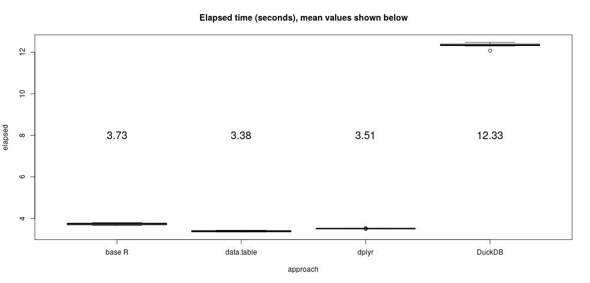
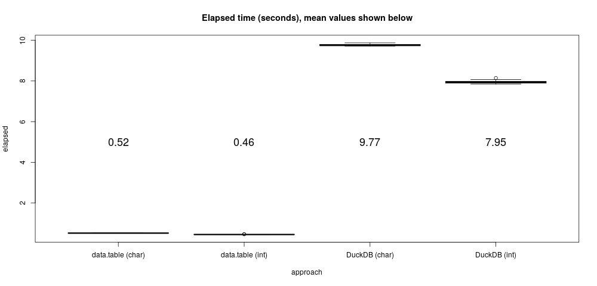

# The DuckDB Small Integer Sort Example

These examples come from DuckDB, see the original 2021-08-27 article here:
https://duckdb.org/2021/08/27/external-sorting.html.

The first example is a very simple one that sorts 100 million randomly sampled
integers. The example illustrates the speed of radix sort in such problems.

Despite mentioning R and dplyr in particular, no comparisons with  R were made
in the DuckDB article.

Note that a radix sort is used by R's data.table
(https://rdatatable.gitlab.io/data.table/). A single-threaded version of the
data.table radix sort was adopted internally by R some time ago (see the R
source main/radixsort.).

So here we go...

## Set up

Not much going on here, sample integers from 1 to 100 million in random order
and put into a column in a data frame.

```{r, echo=TRUE, eval=FALSE}
set.seed(1)
x <- data.frame(ints = sample(seq(100e6)))
```

# Base R

The base R sort defaults to a single-threaded radix sort (based on the
data.table sort) for integer sorting problems.

```{r, echo=TRUE, eval=FALSE}
t_base <- replicate(10, system.time({s <<- x[order(x[["ints"]]), ]}))
```

## DuckDB

The next example uses the elegant native interface between R and DuckDB, and
set the number of threads to use via the DuckDB PRAGMA approach (see
https://duckdb.org/docs/sql/pragmas). This note displays single-threaded and
eight-threaded results.


```{r, echo=TRUE, eval=FALSE}
library(duckdb)
con <- dbConnect(duckdb())
duckdb_register(con, "x", x)
dbExecute(con, "PRAGMA threads=8;")
t_duck <- replicate(10, system.time({s_duck <<- dbGetQuery(con, "SELECT * FROM x ORDER BY ints")}))
```

## Data.table

The example uses the data.table `setDTthreads` function to explicitly set the number of
threads to use.

```{r, echo=TRUE, eval=FALSE}
library(data.table)
setDTthreads(8)
t_dt <- replicate(10, system.time({s_dt <<- data.table(x, key="ints")}))
```

## Dplyr

Dplyr `arrange` I think simply uses the base R sorting algorithms.

```{r, echo=TRUE, eval=FALSE}
library(dplyr)
t_dpl <- replicate(10, system.time({s_dpl <<- x %>% arrange(ints)}))
```

## Performance and comments

Performance results on my 8-core Ryzen laptop are collected below.  Two plots
are shown, one for single-threaded runs and for eight thread runs, which only
affect the data.table and duckDB results.

- The base R and dplyr sort are always single threaded.
- Despite dplyr using base R under the hood it is somehow slightly faster.
- Despite base R using an algorithm based on the data.table one, it's faster than data.table in this example.

Of course this is a very small problem that easily fits in memory. 100 million
integers is only about 400MB or so. My cheap laptop has 8GB of memory.
In-memory analyses represent a sweet spot for languages like R, and it is
probably difficult to exceed R's performance in such cases.

On the other hand, if we need to sort 40 GB of data, well then that's a very
different story. It's possible to work out problems like that in R, it's even
possible to do it efficiently, but it's usually quite a bit more complicated
and often a real hassle.

Systems like DuckDB, on the other hand, "just work" on such large problems with
really no significant changes.  That can be a real advantage!

```{r, echo=TRUE, eval=FALSE}
timings <- rbind(data.frame(approach = "DuckDB", elapsed = t_duck[3, ]),
                 data.frame(approach = "base R", elapsed = t_base[3, ]),
                 data.frame(approach = "dplyr", elapsed = t_dpl[3, ]),
                 data.frame(approach = "data.table", elapsed = t_dt[3, ]))
jpeg(file="sort_upshot.jpg", quality=100, width=1000)
boxplot(elapsed ~ approach, data = timings, main = "Elapsed time (seconds), mean values shown below")
m = aggregate(list(mean=timings$elapsed), by=list(timings$approach), FUN=mean)
text(seq(NROW(m)), y = 6, labels = sprintf("%.2f", m$mean), cex = 1.5)
dev.off()
```

<br/>
<div style='text-align: center; font-weight: 555;'>
NTHREADS = 1
 </img>
<hr/>
NTHREADS = 8
 </img>
</div>


# Note: Radix sorting on non-numeric values

Radix sorts are usually one of the fastest ways to sort most data types. But as
with many sorting methods not paying attention to locale-based collation order
may yield unexpected results, especially for UTF8 character data. Consider the
following simple example:

## Base R

```{r, eval=TRUE, echo=FALSE}
library <- function(...) suppressPackageStartupMessages(base::library(...))
```

```{r, echo=TRUE, message = FALSE, warnings = FALSE}
x <- data.frame(a=strsplit("taW", "")[[1]])
x[order(x$a),,drop = FALSE]
```

## DuckDB

```{r, echo=TRUE}
library(duckdb)
con <- dbConnect(duckdb())
duckdb_register(con, "x", x)
dbGetQuery(con, "SELECT * FROM x ORDER BY a")
```

## DuckDB with `default_collation='nocase'`

```{r, echo=TRUE}
library(duckdb)
con <- dbConnect(duckdb())
duckdb_register(con, "x", x)
dbExecute(con, "PRAGMA default_collation='nocase';")
dbGetQuery(con, "SELECT * FROM x ORDER BY a")
```

## Data.table

```{r, echo=TRUE}
library(data.table)
data.table(x, key = "a")
```

## Base R with radix sort explicitly set

```{r, echo = TRUE}
x[order(x$a, method="radix"),,drop = FALSE]
```

So what's going on here? The default radix sort used by DuckDB and data.table
are effectively sorting character values as ASCII (in the C locale), instead of
in the UTF8 collation locale in use by R, which in this case is `en_US.UTF-8`.
Base R defaults to using a collation sort order appropriate to the system
locale.

Fortunately, one can easily set the collation order in DuckDB as shown in the
second DuckDB example above. I do not know of a way to adjust this in data.table
however :(.


# TPCDS Customer Type Payload

This is another smallish, in-memory test in the blog post (the
https://duckdb.org/images/blog/sorting/tpcds_customer_type_payload_barplot.svg
plot).

This example uses the TPC `dsdgen` program to generate a sample table of 5
million (SF=300) rows and 18 integer- or character-valued columns. Both tables
easily fit into my laptop's memory.

The example compares sorting performance for the whole table using either three
integer columns or two character-valued columns. It replicates the `SF=300` case
shown in the blog post.

Now, the TPC dsdgen program is proprietary so I can't redistributed it
here. But it's easy to download and compile from
http://tpc.org/tpc_documents_current_versions/current_specifications5.asp.
These notes assume that the `dsgen` program is available and set in the
`DSDGEN_PATH` variable in the
https://bwlewis.github.io/duckdb_and_r/sort/tpcds_customer.r 
script.

Once you've got `dsdgen`, running the script 
https://bwlewis.github.io/duckdb_and_r/sort/tpcds_customer.r 
will produce a plot similar to:

 </img>


# Session info

```{r, echo=TRUE}
sessionInfo()
cat(paste(system("free", intern=TRUE), collapse="\n"))
cat(paste(system("cat /proc/cpuinfo", intern=TRUE), collapse="\n"))
```


