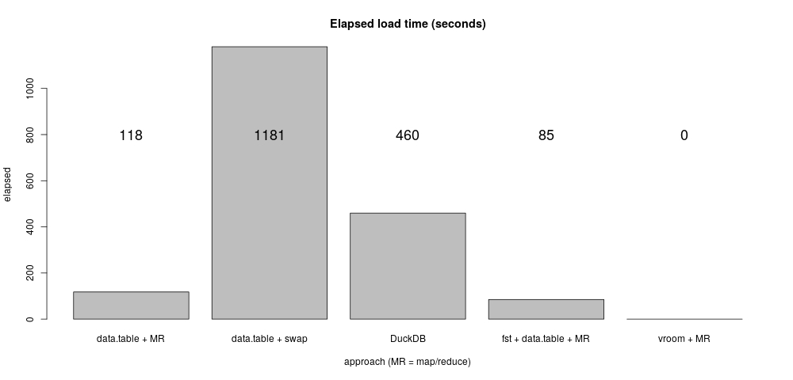
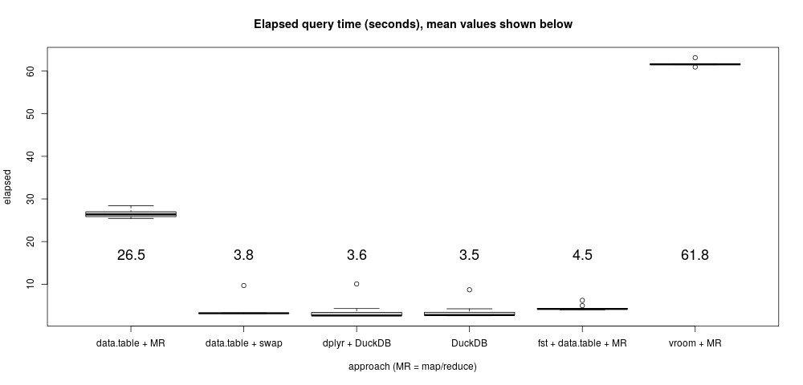

# Summarizing larger-than-memory data, a superb use case for DuckDB

This example highlights a great use case for DuckDB and R: summarizing and
manipulating data that don't fit in main random access memory. The example uses
a small portion of the taxi data made popular by Todd Schneider's excellent
<a href="Analyzing 1.1 Billion NYC Taxi and Uber Trips, with a
Vengeance">Analyzing 1.1 Billion NYC Taxi and Uber Trips, with a Vengeance</a>.
This example uses a simple query (based on query 4) from
<a href="https://tech.marksblogg.com/benchmarks.html">Mark Litwintschik's</a>
rather amazing comparison of techniques to summarize these moderately-sized
data inspired by Schneider's work.

Because my laptop only has 8GB of RAM and a single 500GB solid state disk, the
full example data--consisting of over 330GB of CSV files--is too big.
Complicating things, the raw data formats inconsistently change over time,
addressed partially by both Schneider and Litwintschik using complicated custom
data munging processes. For example, old data include trip start and end
latitude and longitude data, but recent data only include a much coarser
"LocationID" value.^[Note that there is at least one R package
to import these data, https://github.com/beanumber/nyctaxi, but our simplified
example does not need it.]

Fortunately we can illustrate advantages of DuckDB on a much smaller example:
all of the Yellow taxi cab data for 2015. Focussing on one year and one livery
sidesteps the data format consistency issues and yields almost 23GB of raw CSV
files (about 20GB of internal R data.frame storage if it could all be loaded in
memory)--larger than my laptop's 8GB RAM.


## Downloading the data

The short code block below downloads about 23GB of raw CSV data for yellow
taxi trips in the year 2015 as provided by the
<a href="https://www1.nyc.gov/site/tlc/about/tlc-trip-record-data.page">NYC Taxi and Limousine Commission</a>.
Depending on your internet connection, the download process can take a while.
You can experiment with a potentially faster parallelized data download
by replacing the `Map` function with `mcMap` below.

```{r, eval=FALSE}
Map(function(i) {
  f = sprintf("https://s3.amazonaws.com/nyc-tlc/trip+data/yellow_tripdata_2015-%02.0f.csv", i)
  download.file(f, destfile = basename(f))
}, 1:12)
```

After running this, you should have 12 files corresponding to the yellow cab trip data
by month for 2015. The files vary between 1.7 and 2 GB. Each file includes
a header line labeling 19 columns.
All files total 146,112,989 data rows, not counting headers.

## Mark Litwintschik's query 4

<a href="https://tech.marksblogg.com/benchmarks.html">Mark Litwintschik</a> has
done a remarkable job characterizing different approaches to basic data
summaries using the NYC taxi data. The example here is based on Mark's "query 4",
shown as a SQL query below:

```{sql, eval = FALSE}
SELECT passenger_count,
  cast(trip_distance as int) AS distance,
  count(*) AS count
FROM yellow
GROUP BY passenger_count, distance
ORDER BY count desc"
```

The query is very simple. It defines `distance` to be the *integer part* of
each trip distance, then groups by that and `passenger_count` (also an
integer), counting the number of trips (rows) in each group.  Mark's query 4
differs in that it also groups by year, which omitted here because this example
uses only one year.


## Upshot

The following plots show summaries of experiment timings, including average
query execution times and one-off data load times. See below for descriptions
of each approach.

### Load times

</img>

### Query execution times

</img>


### And the winner is...vroom?

It's complicated.

If you're interested in a simple, single one-off query like the test query
presented here--and nothing else--then vroom + map/reduce yields the fastest
overall completion time (including data load). However, because vroom will
parse/load data directly from CSV files lazily for every problem, it quickly
becomes less efficient than the other approaches over subsequent analysis
runs.

The combination of fst + data.table + map/reduce gives you some of the
benefits of vroom (lazily mapping subsets of data into memory as required),
with the advantage of very fast additional analysis speed because the CSV data
parsing is done once. Plus, the fst data files consume only about 7GB disk
space, versus 28GB for DuckDB.

DuckDB strikes a great balance overall. Loading data, while slower than fst +
data.table, was very simple. Once loaded, query speed was extremely fast (the
fastest in these tests). Thus for situations involving many ad-hoc analyses of
these data, DuckDB will likely prevail.

A huge advantage of DuckDB is its simplicity. Unlike the other approaches, you
don't really need to worry about limits on threads or processes to avoid
out-of-memory crashes. Plus, DuckDB can be used with either SQL or dplyr on
problems like this with equal performance.

The down-side of all the map/reduce approaches is their additional complexity
and tuning requirements. Although they work easily for this trivial grouped
aggregation example, more complex queries--say, involving table joins--can be
much harder to implement correctly.

There *is* an up-side to the map/reduce approaches however. They are, by
construction, trivially scalable. For instance, consider working with the full
330GB of CSV files from the NYC taxi commission. All the map/reduce methods are
trivially run in distributed settings across clusters of computers.  The parsed
fst data files could be stored, for example, to an ultra-high aggregate I/O
bandwidth object store like AWS S3 or Minio. Then run the map/reduce steps on
multiple computers across those files, accomplished with hardly any changes to
the code by using R's foreach or future packages. I expect that on a
larger-scale problem like that, the scale-out distributed map/reduce approach
will easily out-perform DuckDB (I will follow up these notes with that
example later).


## DuckDB example.

The DuckDB example begins by loading the CSV data into a single DuckDB table
called "yellow." DuckDB requires a table schema to load into.

```{r, eval=FALSE}
library(duckdb)
Sys.setenv(DUCKDB_NO_THREADS = 8)
files = dir(pattern = "csv$")
con <- dbConnect(duckdb("./duck"))
print(system.time({
  dbExecute(con, "CREATE TABLE yellow(
VendorID INTEGER,
tpep_pickup_datetime TIMESTAMP,
tpep_dropoff_datetime TIMESTAMP,
passenger_count INTEGER,
trip_distance DOUBLE,
pickup_longitude DOUBLE,
pickup_latitude  DOUBLE,
RateCodeID INTEGER,
store_and_fwd_flag  VARCHAR(1),
dropoff_longitude DOUBLE,
dropoff_latitude DOUBLE,
payment_type INTEGER,
fare_amount DOUBLE,
extra DOUBLE,
mta_tax DOUBLE,
tip_amount DOUBLE,
tolls_amount DOUBLE,
improvement_surcharge DOUBLE,
total_amount DOUBLE);")
  for(f in files) {
    q = sprintf("COPY yellow FROM '%s' ( AUTO_DETECT TRUE );", f)
    dbExecute(con, q)
  }
}))

#   user  system elapsed
#257.369  34.990 459.670
```

Direct load of the CSV files was trouble-free and reasonably efficient, taking
about 460 seconds on my laptop.  Now, let's run the test SQL query 10 times:
```{r, eval=FALSE}
q <- "
SELECT passenger_count,
  cast(trip_distance as int) AS distance,
  count(*) AS count
FROM yellow
GROUP BY passenger_count, distance
ORDER BY count desc"
t_duck <- replicate(10, system.time({
  ans_duck <<- dbGetQuery(con, q)
}))
```
Performance of this query was outstanding, averaging 3.5 seconds--exceeding anything
I was able to conjure up in R directly so far (see below).
Plus the whole process from loading to querying was pretty easy...

## DuckDB + dplyr

...but I generally prefer to use something like dplyr to express the query
instead of SQL for many reasons. The next example uses the same "yellow" DuckDB
table created in the previous example, but queries it via dplyr instead of a
native SQL statement. Hopefully it does not introduce much overhead.

```{r, eval=FALSE}
library(dplyr)
t_duck_dplyr <- replicate(10, system.time({
  ans_duck_dplyr <<- tbl(con, "yellow") %>%
  select(passenger_count, trip_distance) %>%
  mutate(distance = as.integer(trip_distance)) %>%
  group_by(passenger_count, distance) %>%
  summarize(count = n()) %>%
  arrange(desc(count)) %>%
  collect
}))

# `summarise()` has grouped output by 'passenger_count'. You can override using the `.groups` argument.
```
Aside from a cryptic note, everything runs great here, averaging about
3.6 seconds--practically identical to the native SQL dplyr result above. That odd
message about grouping confused me because I want to explicitly group by the
variables that I indicated (that is, `passenger_count` and `distance`, not just
`passenger_count`). Apparently,
this needs to be made explicit in the `summarize` function using the (experimental)
option shown below:
```{r, eval=FALSE}
  ...
  summarize(count = n(), .groups = "keep") %>%
  ...
```
With that somewhat unfortunate change, the message goes away and everything is fine.


## Data.table ... plus lots of swap space

These data are too big to fit in my laptop's RAM, so this does not work:
```{r, eval = FALSE}
library(data.table)
setDTthreads(8)
files = dir(pattern = "csv$")

yellow = data.table()
print(system.time({
  for(f in files) yellow <- rbind(yellow, fread(f), fill = TRUE)
}))
```

*But*, by ludicrously increasing swap space on my system it will work. For example
```
sudo dd if=/dev/zero of=/swap50G bs=1G count=50
sudo mkswap /swap50G
sudo chmod chmod 600 /swap50G
sudo swapon /swap50G
```
Now the above code works, but it takes a long time because this is a kind of dumb
approach. It took about 1181 seconds on my laptop, much slower than the DuckDB
data load.

Once loaded, the data.table equivalent to query 4 is simply:
```{r, eval = FALSE}
t_dtswap <- replicate(10, system.time({
  ans_dtswap <<- yellow[, list(count = .N), by = list(passenger_count, distance=as.integer(trip_distance))][order(count, decreasing = TRUE)]
}))
```

This took an average of about  3.8 seconds on my laptop, so just a little bit
slower than the DuckDB query time.  Recall that, for in-memory problems like
this, data.table is almost always the fastest approach. Here we see the tables
turn a bit. Not only do we have to enable a huge amount of swap space, but the
load speed is very slow and query performance is also a bit slower.


## Data.table ... map/reduce style

Here is a data.table approach that does not require a ludicrous amount of swap
to use. This approach leverages the fact that the query is easily decomposed
into independent sub-problems (a so-called "map" step), whose solutions can
then be combined through a function into the final result (the "reduce" step).
Since the data are presented as monthly files, mapping across the files is
natural.

This approach proceeds in two steps: first, parse each CSV file into an
in-memory R data.table representation and save that (roughly analogous to the
DuckDB table ingest process); second run the map/reduce program across the
saved data.files.

Note that to avoid running out of memory each step carefully limits the
maximum number of parallel R processes.

### Data parsing step

This step converts each CSV file into an (uncompressed) on-disk data.frame
representation. It runs remarkably fast on my laptop, at least compared to
the DuckDB load step.

```{r, eval = FALSE}
library(data.table)
library(parallel)
options(mc.cores = 3)
setDTthreads(4)
print(system.time({
ans = rbindlist(mcMap(function(x) {
  rds = gsub("csv$", "rds", x)
  saveRDS(fread(x, showProgress = FALSE), file = rds, compress = FALSE)
}, dir(pattern = "*.csv"))
)}))

#   user  system elapsed
# 91.541  18.990 117.808
```

### Map/reduce step

A map/reduce-like analog of the test query proceeds as follows:
```{r, eval=FALSE}
t_dtsplit <- replicate(10, system.time({
  ans_dtsplit <<- rbindlist(mcMap(function(f) {
    readRDS(f)[, list(count=.N), by = list(passenger_count, distance=as.integer(trip_distance))]
  }, dir(pattern = "rds$")))[, list(count = sum(count)), by = list(passenger_count, distance)][order(count, decreasing = TRUE)]
}))
```
The approach works, that is it produces output like the DuckDB output, but
runs much more slowly than DuckDB, averaging about 27 seconds.

Why so slow? Monitoring the runs, I noticed that most of the time is spent in
I/O.  That's because for each month, we read the *entire* data.table associated
with that month into R's memory--instead of just the few columns we need to run
the query.

Is there an easy way to address that problem? The answer is yes...


## Fst + data.table ... map/reduce style

Mark Klik's <a href="http://www.fstpackage.org/">fst</a> package for R is a
very *very* efficient data frame/data.table serialization approach with clever
functions to reduce I/O. In particular, one can easily retrieve only a subset
of columns of
interest from disk. The fst package also uses state-of-the-art
efficient compression methods.

This example repeats the previous data.table-only map/reduce one, but using
fst to process the on-disk files.


### Data parsing step

Similarly to the last example, we carefully control the number of threads used
by both data.table and fst to avoid over-committing CPU and I/O resources too
much.

```{r, eval=FALSE}
library(data.table)
library(fst)
setDTthreads(2)
threads_fst(4)
print(system.time({
  for(f in dir(pattern="*.csv")) {
    fst <- gsub("csv$", "fst", f)
    write_fst(fread(f, showProgress = FALSE), path = fst)
  }
}))

#   user  system elapsed
#143.129  15.846  85.050
```

Using the combination of fst and data.table, all the raw CSV files are
processed into R data.tables and saved to disk in only 85 seconds on my
laptop--much faster than any other approach I have tried so far.

### Map/reduce step

Now apply the map/reduce method to the saved data files. Note that the fst
package running via `mcMap` below automatically, and conveniently, drops to
using one thread per child R process (which is usually what you want in cases
like this with mixed process- and thread-level parallelism).

```{r, eval=FALSE}
library(parallel)
options(mc.cores=3)
t_fst <- replicate(10, system.time({
ans_fst <<- rbindlist(mcMap(function(path) {
  data.table(fst(path)[, c("passenger_count", "trip_distance")])[, list(count=.N), by = list(passenger_count, distance=as.integer(trip_distance))]
}, dir(pattern = "fst$")))[, list(count = sum(count)), by = list(passenger_count, distance)][order(count, decreasing = TRUE)]
}))
```

The performance of this mixed fst/data.table approach is excellent, averaging
about 4.5 seconds on my laptop. It's still slower than DuckDB though!


## VROOM! VROOM!

If this were a one-off problem and you only ever want to run one query, then
the fst map/reduce approach does that in about 90 seconds versus about 464 for
DuckDB.  In the much more likely case that you're interested in other analyses,
or perhaps computations involving operations that take more work to fit into a
map/reduce approach (say, for instance, operations involving complex joins),
then DuckDB is the way to go.

Out of curiosity I wanted to try a really neat approach to one-off problems,
R's <a href="https://vroom.r-lib.org/">vroom</a> package. The vroom package
presents CSV files as a semi-lazy data.frame that for the most part only parses
and retrieves data when needed. That is, vroom is perfectly suited to
work involving a small subset of a huge CSV file.
Our test query only needs two columns out of 19, so vroom should work well.

Alas, my first try at vroom crashed:
```{r, eval=FALSE}
library(vroom)
x <- vroom::vroom(dir(pattern = "csv$"))
```

Let's try map/reduce style instead, again using data.table to perform the
aggregation and vroom for data access. I had to limit things to two extra
R parallel processes to avoid hitting out-of-memory crashes below, but
it works!

```{r, eval=FALSE}
options(mc.cores = 2)
types <- "iTTidddicddiddddddd"
t_vroom <- replicate(5, system.time({
ans_vroom <<- rbindlist(Map(function(x) {
  f <- vroom(x, col_names = TRUE, col_types = types)
  data.table(f[, c("passenger_count", "trip_distance")])[, list(count=.N), by = list(passenger_count, distance=as.integer(trip_distance))]
}, dir(pattern = "*.csv"))
)[, list(count = sum(count)), by = list(passenger_count, distance)][order(count, decreasing = TRUE)]}))
```
The vroom way took about 62 seconds, with zero data load time. Thus it's the fastest way to
run this query as a one-off analysis. If, on the other hand, you intend to perform other
tasks on these data, say table joins or other kinds of aggregations, etc., then DuckDB
is the way to go.
