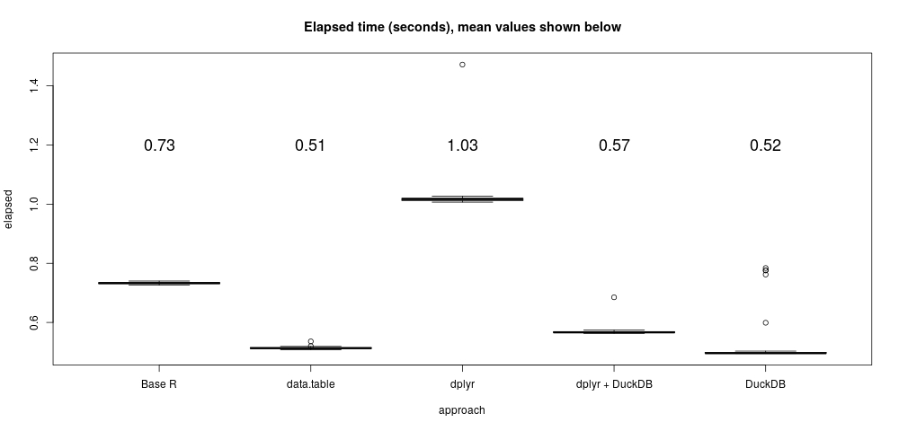

# The DuckDB TPCH Example

This example comes from DuckDB, see the original 2021-05-14 article here:
https://duckdb.org/2021/05/14/sql-on-pandas.html.

The example is adapted from a TPC-H benchmark (http://www.tpc.org/tpch/).  It's
not that big or complex, consisting of basic grouped statistics computed from a
join of row-filtered tables. The larger table has about 6 million rows (16
columns), the smaller about 1.5 million rows and 9 columns.  It's the kind of
stuff SQL databases should excel at.  It easily fits in the memory of my
laptop.  Only the final and most computationally expensive query in the DuckDB
example is used here.

This piece explores a few R approaches to the problem, comparing style and, for
what it's worth on such a simple problem, performance. Let's start with the
DuckDB SQL approach.

## Set up and a DuckDB Query

The following code block downloads the two example data files (in Parquet
format), loads them into DuckDB and runs the example query 50 times, capturing
the timing results.

```{r, echo=TRUE, eval=FALSE}
# Download the example data
download.file("https://github.com/cwida/duckdb-data/releases/download/v1.0/lineitemsf1.snappy.parquet",
              destfile = "lineitemsf1.snappy.parquet")
download.file("https://github.com/cwida/duckdb-data/releases/download/v1.0/orders.parquet",
              destfile = "orders.parquet")

NTHREADS <- parallel::detectCores()
Sys.setenv(DUCKDB_NO_THREADS = NTHREADS)
library(duckdb)
con <- dbConnect(duckdb())
# Load from parquet files into DuckDB
dbExecute(con, "CREATE TABLE lineitem AS SELECT * FROM 'lineitemsf1.snappy.parquet'")
dbExecute(con, "CREATE TABLE orders AS SELECT * FROM 'orders.parquet'")
Q <- "SELECT l_returnflag,
      l_linestatus,
      sum(l_extendedprice),
      min(l_extendedprice),
      max(l_extendedprice),
      avg(l_extendedprice)
      FROM lineitem lineitem
      JOIN orders orders ON (l_orderkey=o_orderkey)
      WHERE l_shipdate <= DATE '1998-09-02'
      AND o_orderstatus='O'
      GROUP BY l_returnflag, l_linestatus"
t1 <- replicate(50, system.time({duck <<- dbGetQuery(con, Q)}))
```

The query is pretty straightforward. I wonder just a little about how the `<=`
in `WHERE l_shipdate <= DATE '1998-09-02'` is evaluated because `l_shipdate` in
the Parquet file stores character-valued data. DuckDB's rules for implicit type
casting are slightly mysterious (https://duckdb.org/docs/sql/expressions/cast).
In this example using character or date types probably does not matter, but
there might be a small performance gain by avoiding an unnecessary type
conversion in the query.


## A straight-up vectorized R approach

First, we need to transfer the DuckDB tables into plain old R data frames,
and let's deal with that date type ambiguity mentioned above as well:

```{r, echo=TRUE, eval=FALSE}
lineitem <- dbGetQuery(con, "SELECT * FROM lineitem")
orders <- dbGetQuery(con, "SELECT * FROM orders")
lineitem[["l_shipdate"]] <- as.Date(lineitem[["l_shipdate"]])
```

For me at least, a natural base R approach to problems like this relies on
mostly on vectorized operations. The variable `h` indicates which rows of the
`orders` data frame match the condition. Similarly, `i` filters the `lineitem`
table rows on the date and join conditions. The statistics on `l_extendedprice`
are mapped over the `l_returnflag` and `l_linestatus` groups by `Map`.

```{r, echo=TRUE, eval=FALSE}
t2 <- replicate(50, system.time({
  h <- orders[["o_orderstatus"]] == "O"
  i <- lineitem[["l_orderkey"]] %in%  orders[["o_orderkey"]][h]   &
       lineitem[["l_shipdate"]] <= as.Date("1998-09-02")
  vec <<- Map(function(x) list(sum = sum(x, na.rm = TRUE),
                               min = min(x, na.rm = TRUE),
                               max = max(x, na.rm = TRUE),
                               avg = mean(x, na.rm = TRUE)),
               split(lineitem[["l_extendedprice"]][i],
                     interaction(lineitem[["l_returnflag"]][i], lineitem[["l_linestatus"]][i])))
}))
```

One minor thing to notice, the computed results are slightly different from DuckDB's:

```{r, echo=TRUE, eval=FALSE}
vec[[1]]$sum - duck[[3]] 

#[1] 0.00289917
```

That's because `l_extended_price` is represented by double-precision floating
point values and R's `sum` function uses (platform-specific) extended-precision
precision double arithmetic under the hood for accuracy.  In this example, the
R result is  slightly more accurate (you can see this, for instance, using the
Rmpfr package). Also note that floating point results can vary depending on the
order in which they are computed. R attempts to mitigate some floating point
problems like this, at least for summation.


## Dplyr

The dplyr data manipulation grammar hews to Codd's relational algebra but,
in my opinion, is much more expressive, composable, and readable than SQL.

```{r, echo=TRUE, eval=FALSE}
library(dplyr)
t3 <- replicate(50, system.time({
  o <- orders %>%
       select(o_orderkey, o_orderstatus)  %>%
       filter(o_orderstatus == "O")
  dpl <<- lineitem %>%
           select(l_orderkey, l_shipdate, l_returnflag, l_linestatus, l_extendedprice) %>%
           filter(l_shipdate <= as.Date("1998-09-02")) %>%
           inner_join(o, by = c("l_orderkey" = "o_orderkey")) %>%
           group_by(l_returnflag, l_linestatus) %>%
           summarize(sum = sum(l_extendedprice, na.rm = TRUE),
                     min = min(l_extendedprice, na.rm = TRUE),
                     max = max(l_extendedprice, na.rm = TRUE),
                     avg = mean(l_extendedprice, na.rm = TRUE), .groups = "keep")
}))
```

## Dplyr + DuckDB

A beautiful thing about dplyr and R's lazy evaluation is that dplyr can act as
a kind of query builder for back end database systems (most of the time). This
layers the expressive syntax of dyplr over any kind of back-end database,
taking advantage of the database query optimization and other optimization
tricks.

Dplyr using a DuckDB back end looks almost exactly like the previous example,
but thanks to optimization by DuckDB runs a bit faster.

```{r, echo=TRUE, eval=FALSE}
t4 <- replicate(50, system.time({
  o <- tbl(con, "orders") %>%
      select(o_orderkey, o_orderstatus)  %>%
      filter(o_orderstatus == "O")
  dplyr_duck <<- collect(tbl(con, "lineitem") %>%
             select(l_orderkey, l_shipdate, l_returnflag, l_linestatus, l_extendedprice) %>%
             filter(l_shipdate <= as.Date("1998-09-02")) %>%
             inner_join(o, by = c("l_orderkey" = "o_orderkey")) %>%
             group_by(l_returnflag, l_linestatus) %>%
             summarize(sum = sum(l_extendedprice, na.rm = TRUE),
                       min = min(l_extendedprice, na.rm = TRUE),
                       max = max(l_extendedprice, na.rm = TRUE),
                       avg = mean(l_extendedprice, na.rm = TRUE), .groups = "keep"))
}))
```

## Data.table

R's data.table package can almost always exceed the performance of any other
approach.  Aside from speed, data.table is known for a very terse syntax, but
it's also very well documented.  (And more recently, dplyr partially supports
data.table as a back end too.)

```{r, echo=TRUE, eval=FALSE}
library(data.table)
setDTthreads(NTHREADS)
lineitem <- as.data.table(lineitem)
orders <- as.data.table(orders)

t5 <- replicate(50, system.time({
  dtbl <<- (lineitem[l_shipdate <= as.Date("1998-09-02"),
                     c("l_orderkey", "l_returnflag", "l_linestatus", "l_extendedprice")
                    ] [orders[o_orderstatus == "O", "o_orderkey"],
                on = c("l_orderkey" = "o_orderkey"), nomatch = NULL]
           ) [, list(sum = sum(l_extendedprice, na.rm=TRUE),
                     min = min(l_extendedprice, na.rm=TRUE),
                     max = max(l_extendedprice, na.rm=TRUE),
                     avg = mean(l_extendedprice, na.rm=TRUE)), by=c("l_linestatus", "l_returnflag")]
}))
```


## Performance and comments

Stylistically, I prefer either the vectorized base R way or the dplyr approach.
Dplyr has the advantage of easily generalizing to more complicated tasks and
the ability to work as a front end to database (like DuckDB) and other systems.


```{r, echo=TRUE, eval=FALSE}
timings <- rbind(data.frame(approach = "DuckDB", elapsed = t1[3, ]),
                 data.frame(approach = "Base R", elapsed = t2[3, ]),
                 data.frame(approach = "dplyr", elapsed = t3[3, ]),
                 data.frame(approach = "dplyr + DuckDB", elapsed = t4[3, ]),
                 data.frame(approach = "data.table", elapsed = t5[3, ]))
boxplot(elapsed ~ approach, data = timings, main = "Elapsed time (seconds), mean values shown below")
m = aggregate(list(mean=timings$elapsed), by=list(timings$approach), FUN=mean)
text(seq(NROW(m)), y = 1.2, labels = sprintf("%.2f", m$mean), cex = 1.5)
```

 </img>

Performance-wise, it's a bit of a wash perhaps because this is a fairly trivial
example. All the approaches perform well. Data.table, as usual, and DuckDB
give nearly identical performance and are fastest.

Dplyr + DuckDB gives you all the advantages of dplyr and the speed of DuckDB
for this problem, a good combination!
